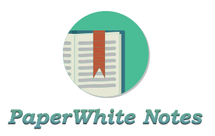
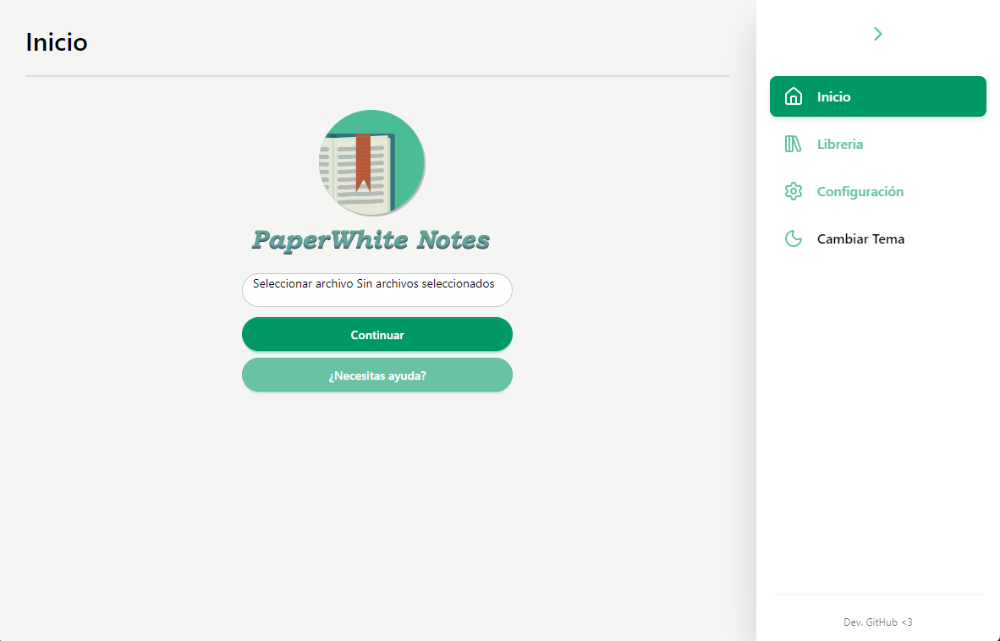
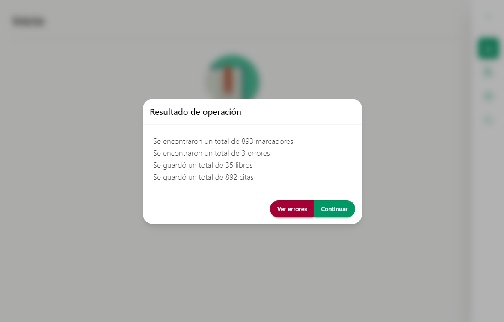
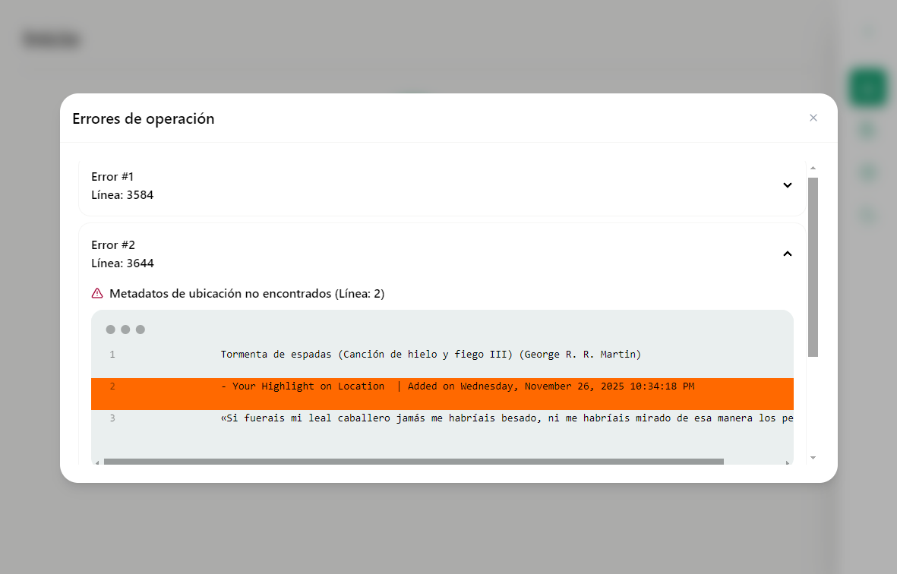
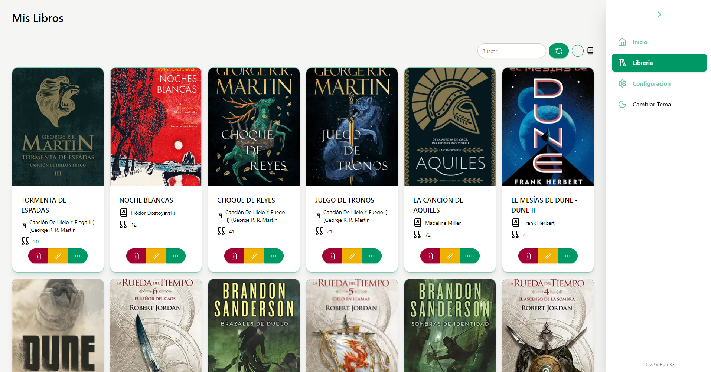
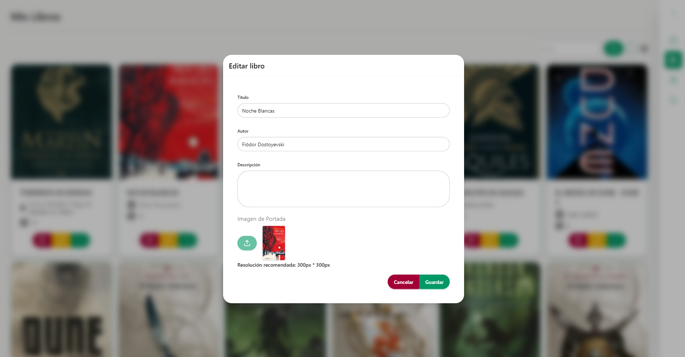
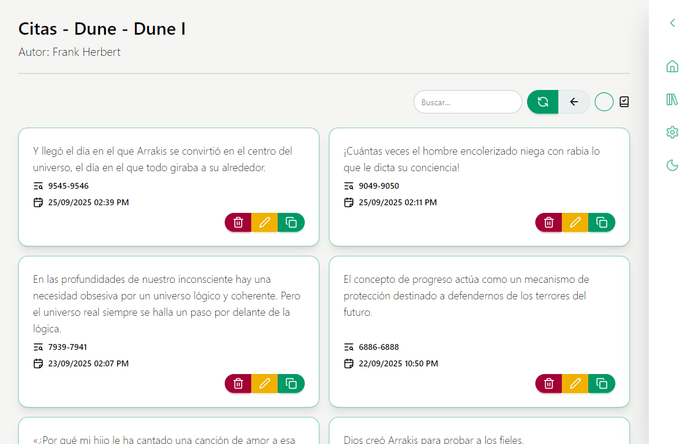
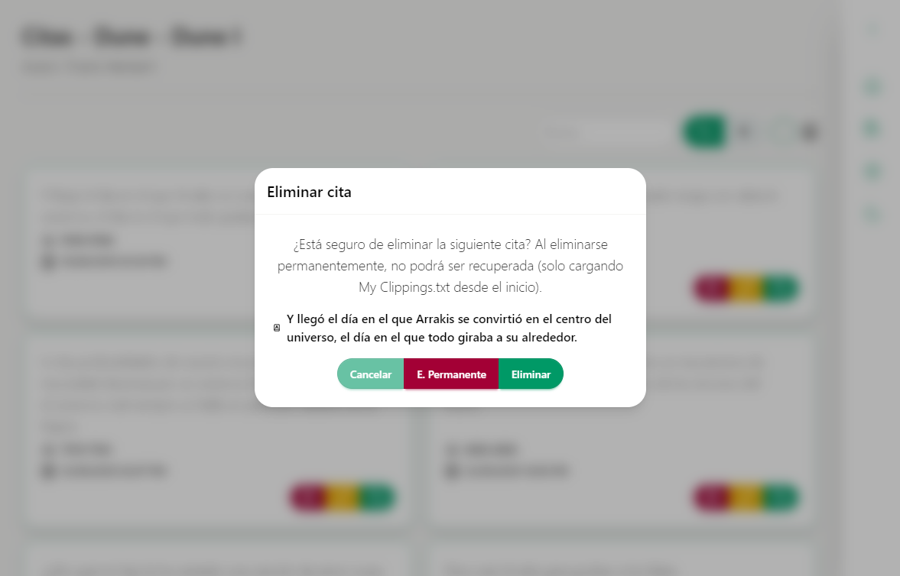
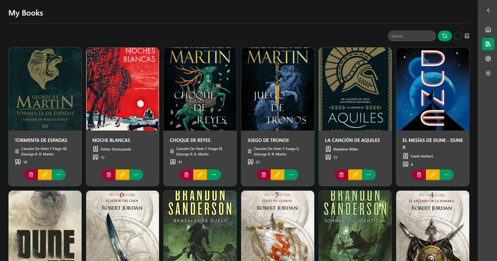
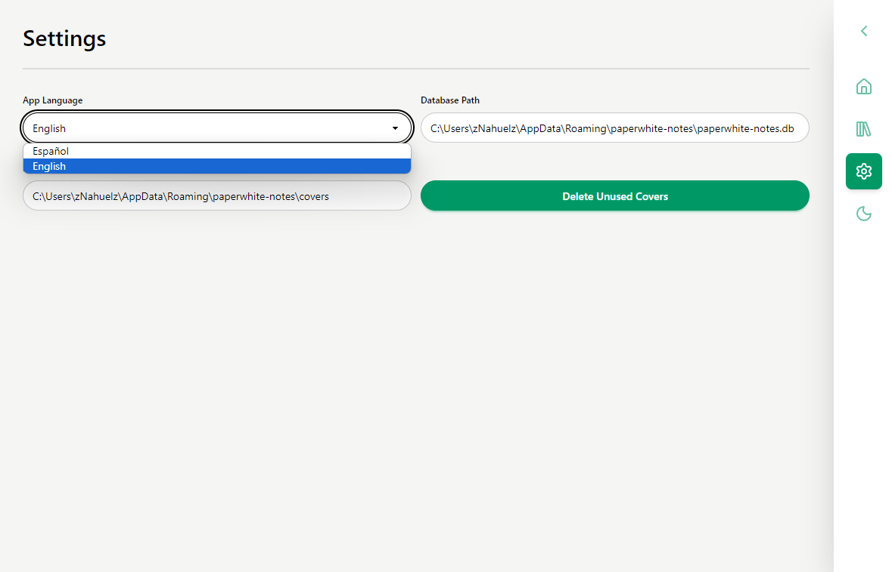

  

  <b>Español</b> | <a href="./README_EN.md">English</a>

# Descripción

PaperWhite Notes es una aplicación de escritorio simple para la importación, gestión y visualización de citas del dispositivo Amazon Kindle. Desarrollado utilizando Electron y Vue.

## Características

- Importación de citas del archivo "My Clippings.txt"
- Organización de las citas según libro
- Gestión de libros: Modificación de título, autor, sinopsis y asignación de portada
- Gestión de citas: Copiar para compartir, editar y eliminar
- Eliminación de imáges de portadas no utilizadas
- Multilenguaje (español e ingles)
- Modo claro y oscuro

## Tecnologías y dependencias

- [Electron v30](https://www.electronjs.org/) (Framework)
- [Vue](https://vuejs.org/) (Frontend)
- [VueRouter](https://router.vuejs.org/) (Router)
- [i18n](https://vue-i18n.intlify.dev/) (Plugin para idiomas)
- [Tailwind](https://tailwindcss.com/) (Interfaces)
- [DaisyUI](https://daisyui.com/) (Interfaces)
- [@iconify/vue](https://iconify.design/) (Iconos)
- [Day.js](https://day.js.org/) (Librería para fechas/horas)
- [WiseLibs/better-sqlite3](https://github.com/WiseLibs/better-sqlite3) (Librería SQLite)

## Requisitos

- [NodeJS Versión >=20](https://nodejs.org/en)

## Compatibilidad

- [Windows >=10](https://www.microsoft.com/en-us/software-download/windows10)
- Linux y MacOS (Puedes intentar compilarlo vos!)
- Linux: Puedes encontrar un .zip en la sección [releases](https://github.com/zNahuelz/paperwhite-notes/releases)

## Uso

### Modo desarrollo

Cumplidos los requisitos para ejecutar el proyecto, puedes probar la herramienta siguiendo estos pasos:

- Clonar el repositorio. `git clone https://github.com/zNahuelz/paperwhite-notes.git`
- Entrar en el directorio. `cd paperwhite-notes-main`
- Descargar dependencias. `npm i`
- Ejecutar el programa en modo desarrollo. `npm run dev`

### Instalación y versión portable

Puedes dirigirte a la sección de [releases](https://github.com/zNahuelz/paperwhite-notes/releases) para descargar la última versión de la aplicación.

- El archivo .exe te permite instalar la aplicación de forma fácil y rápida, dejando un acceso directo tanto en el escritorio como en el menú inicio.
- El archivo .zip te permite descargar la versión portable de la aplicación (para utilizarlo sin necesidad de instalarlo); solo descomprime el archivo y ejecuta "PaperWhite Notes.exe"

## Imágenes

Inicio

Importar libros y citas

Errores en importación

Librería

Modificar libro

Citas

Eliminación de cita

Tema oscuro

Configuración

