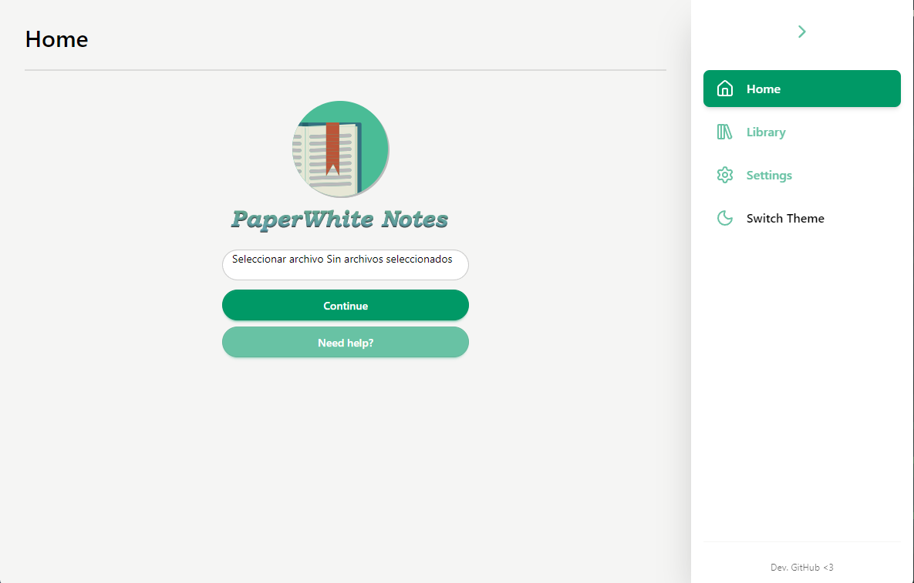
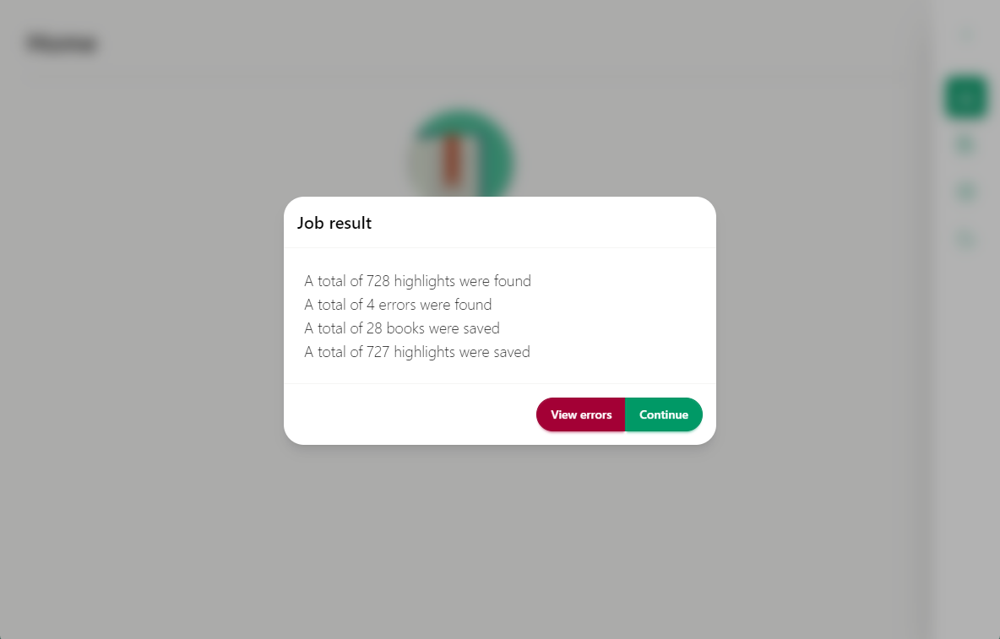
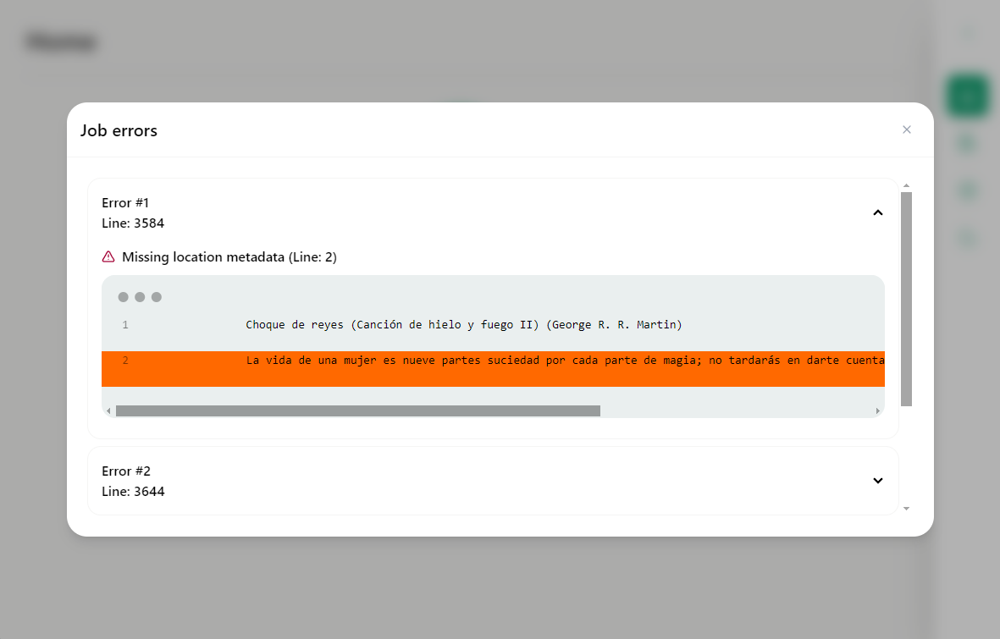
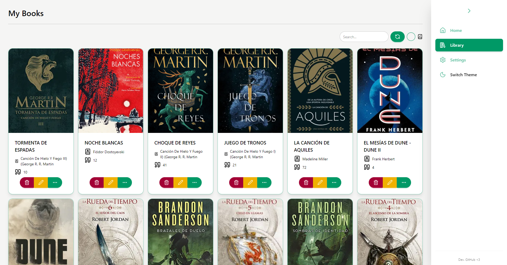
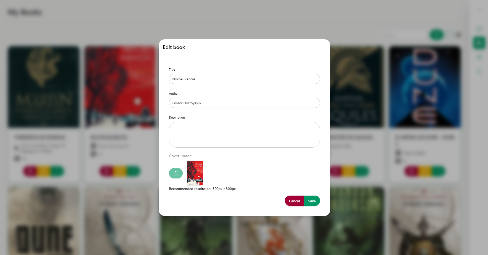
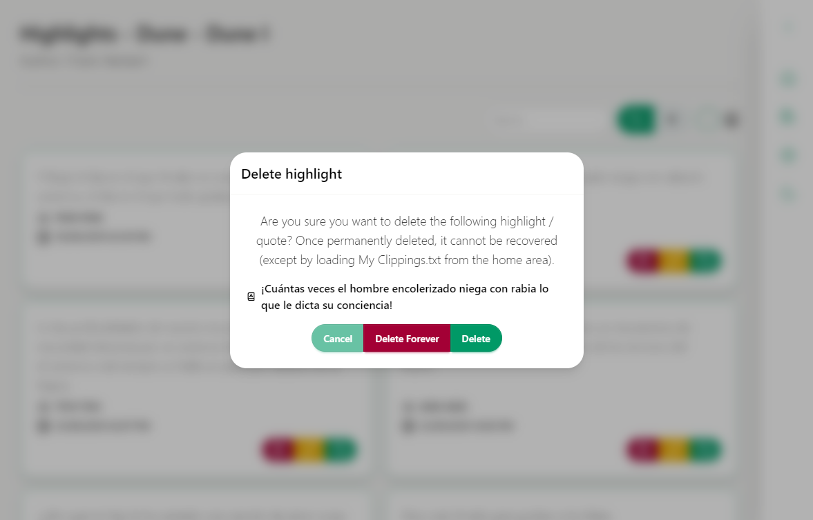

  

  <b>English</b> | <a href="./README.md">Spanish</a>

# Description

PaperWhite Notes is a simple desktop application for importing, managing, and viewing highlights from your Amazon Kindle device. Developed using Electron and Vue.

## Features

- Import highlights from the "My Clippings.txt" file
- Organize highlights by book
- Book management: Modify title, author, synopsis, and assign cover images
- Highlights management: Copy to share, edit, and delete
- Delete unused cover images
- Multilingual (English and Spanish)
- Light and dark mode

## Technologies and Dependencies

- [Electron v30](https://www.electronjs.org/) (Framework)
- [Vue](https://vuejs.org/) (Frontend)
- [VueRouter](https://router.vuejs.org/) (Router)
- [i18n](https://vue-i18n.intlify.dev/) (Language plugin)
- [Tailwind](https://tailwindcss.com/) (Interfaces)
- [DaisyUI](https://daisyui.com/) (Interfaces)
- [@iconify/vue](https://iconify.design/) (Icons)
- [Day.js](https://day.js.org/) (Date/Time Library)
- [WiseLibs/better-sqlite3](https://github.com/WiseLibs/better-sqlite3) (SQLite Library)

## Requirements

- [NodeJS Version >=20](https://nodejs.org/en)

## Compatibility

- [Windows >=10](https://www.microsoft.com/en-us/software-download/windows10)
- Linux y MacOS (You can try compiling it yourself!)
- Linux: There's a .zip available on the [releases](https://github.com/zNahuelz/paperwhite-notes/releases) section

## Usage

### Development Mode

Once you meet the requirements to run the project, you can test the tool by following these steps:

- Clone the repository. `git clone https://github.com/zNahuelz/paperwhite-notes.git`
- Enter the directory. `cd paperwhite-notes-main`
- Download dependencies. `npm i`
- Run the program in development mode. `npm run dev`

### Installation and portable version

You can go to the [releases](https://github.com/zNahuelz/paperwhite-notes/releases) section to download the latest version of the application.

- The .exe file allows you to install the program quickly and easily, creating a shortcut on both your desktop and start menu.
- The .zip file allows you to download the portable version of the program (to use it without installation); simply extract the file and run "PaperWhite Notes.exe"

## Images

Home

Import books and highlights

Import errors

Library

Edit book

Highlights

Delete highlight

Dark theme

Settings

